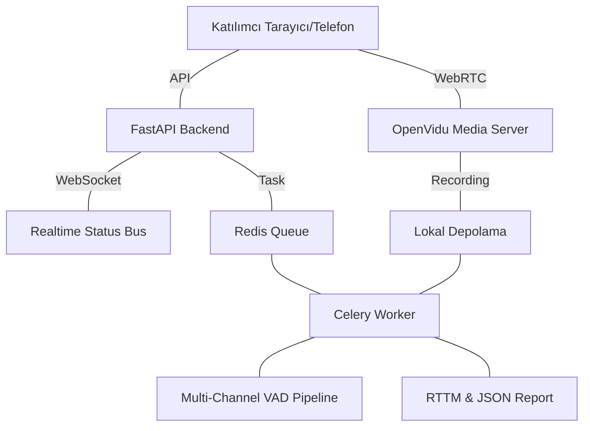

# Akıllı Toplantı Analiz Sistemi (Intelligent Meeting Analysis)

Bu proje, çok katılımcılı çevrimiçi toplantıları gerçek zamanlı olarak izleyen, konuşmacıları kanal bazlı (speaker-aware) ayrıştıran ve toplantı sonunda detaylı analiz raporları (RTTM, Konuşma İstatistikleri) sunan uçtan uca bir platformdur.

---

## 🚀 Öne Çıkan Özellikler

-   **Mimariden Gelen Diyarizasyon:** Her katılımcı ayrı bir stream olarak alındığı için "kimin konuştuğu" bilgisi %100 doğrulukla saptanır.
-   **Çok Kanallı VAD (Voice Activity Detection):** Mikrofon sızıntılarını (bleed) ve eko gürültülerini bastıran, adaptif enerji eşiği tabanlı gelişmiş ses algılama.
-   **Asenkron İşlem Mimarisi:** Ses analizi ve sızıntı tespiti gibi ağır işlemler Celery ve Redis kullanılarak arka planda kuyruğa alınır.
-   **Gerçek Zamanlı Durum Takibi:** Kimin o an konuştuğunu anlık olarak görselleştiren Webhook/SSE tabanlı haberleşme bus'ı.
-   **Zengin Raporlama:** Toplantı sonunda otomatik üretilen RTTM dosyaları, JSON istatistikleri ve katılımcı bazlı metrikler.

---

## 🏗 Mimari Yapı



---

## 🛠 Hızlı Başlangıç (Geliştirme Ortamı)

### Ön Koşullar
-   **Docker Desktop** (Çalışıyor olmalı)
-   **Node.js** (v18+)
-   **Python** (3.10+)

### Kurulum Adımları

1.  **Bağımlılıkları Kurun:**
    ```powershell
    # Frontend
    cd frontend
    npm install
    cd ..

    # Backend
    cd meeting_analyzer
    pip install -r requirements.txt
    pip install -r requirements_async.txt
    cd ..
    ```

2.  **Sistemi Başlatın:**
    Kök dizindeki PowerShell betiği ile tüm bileşenleri (Redis, OpenVidu, Backend, Frontend) tek seferde başlatabilirsiniz:
    ```powershell
    .\start-remote-test.ps1
    ```

---

## 🌐 Uzaktan Test ve ngrok Yapılandırması

Dışarıdan (farklı cihazlardan) katılımcı davet etmek için ngrok kullanılır. Sistemin bu modda sorunsuz çalışması için şu adımları izleyin:

1.  **ngrok Başlatma:** `.\start-remote-test.ps1` betiği otomatik olarak frontend portunu (5173) dışarı açar.
2.  **Domain Ayarı:** Betik otomatik olarak ngrok host bilgisini OpenVidu (`DOMAIN_OR_PUBLIC_IP`) ve Backend konfigürasyonuna aktarır.
3.  **Güvenlik:** Mikrofon izinleri için mutlaka **https://** üzerinden erişim sağlayın.
4.  **Temizlik:** Port çakışması durumunda: `taskkill /f /im ngrok.exe`

---

## ⚡ Asenkron Mimari (Celery & Redis)

Sistem, yük altındayken bile akıcılığını korumak için asenkron bir görev kuyruğu kullanır.

-   **Redis:** Mesaj aracısı (broker) ve sonuç deposu olarak görev yapar.
-   **Celery Worker:** Kayıtları işleme, VAD analizi ve ses sızıntısı filtreleme işlemlerini yapar.
-   **Monitoring:** İşlemleri izlemek için Flower kullanabilirsiniz:
    ```bash
    cd meeting_analyzer
    celery -A src.celery_app flower --port=5555
    ```

---

## 📂 Proje Yapısı

-   `/meeting_analyzer`: FastAPI ana sunucusu, Celery görevleri ve VAD modülleri.
-   `/frontend`: React + Vite + Tailwind ile geliştirilmiş toplantı arayüzü.
-   `/recordings`: Toplantı kayıtları, standardize edilmiş sesler ve raporlar.
-   `docker-compose.yml`: Infrastructure servisleri (Redis, OpenVidu).

---

## ⚠️ Kritik Notlar

-   **Versiyon Uyumu:** OpenVidu sunucusu 2.30.0 sürümündedir. Frontend kütüphanesi ile uyumluluğa dikkat edilmelidir.
-   **Asenkron Yapılandırma:** `.env` dosyasında `CELERY_BROKER_URL` değerinin doğruluğunu kontrol edin.
-   **Mikrofon Sızıntısı (Bleed):** `BLEED_RATIO` parametresi (varsayılan 0.15) ile diğer kanallardan gelen gürültü bastırma seviyesini ayarlayabilirsiniz.

---

## 📜 Lisans
Bu proje geliştirme ve araştırma amaçlıdır.
